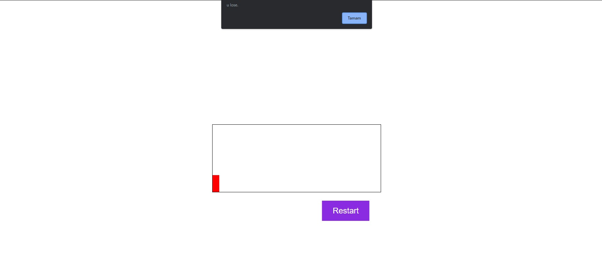
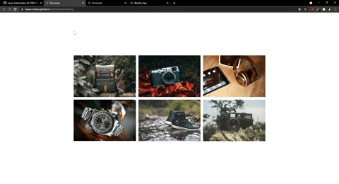
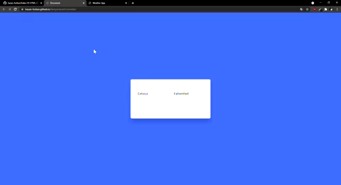
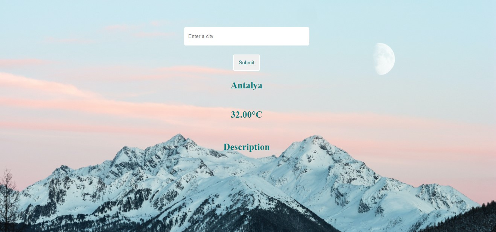

 
<h1 align="center">Index of HTML, CSS & JavaScript Projects</h1>

<table>
    <thead>
        <tr>
            <td>Project Name</td>
            <td>Repo Link</td>
            <td>App Link</td>
            <td>Overview</td>
        </tr>
    </thead>
    <tbody> 
        <tr>
            <td>Escape the Block</td>
            <td><a href="https://github.com/NurKevser/Escape-The-Block" target="_blank">Repo details</a></td>
            <td><a href="https://nurkevser.github.io/Escape-The-Block/" target="_blank">Click here to see the project</a></td>
            <td></td> 
        </tr>
        <tr>
            <td>lightboxSliderGallery</td>
            <td><a href="https://github.com/NurKevser/Lightbox-Gallery" target="_blank">Repo details</a></td>
            <td><a href="https://nurkevser.github.io/Lightbox-Gallery/" target="_blank">Click here to see the project</a></td>
            <td></td> 
        </tr>
        <tr>
            <td>temperatureConverter</td>
            <td><a href="https://github.com/NurKevser/Temperature-Converter" target="_blank">Repo details</a></td>
            <td><a href="https://nurkevser.github.io/Temperature-Converter/" target="_blank">Click here to see the project</a></td>
            <td></td> 
        </tr>  
        <tr>
            <td>weatherApp</td>
            <td><a href="https://github.com/NurKevser/weather-app" target="_blank">Repo details</a></td>
            <td><a href="https://nurkevser.github.io/weather-app/" target="_blank">Click here to see the project</a></td>
            <td></td> 
        </tr>
</tbody>
</table>